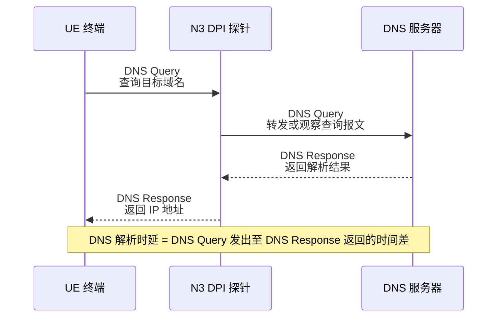
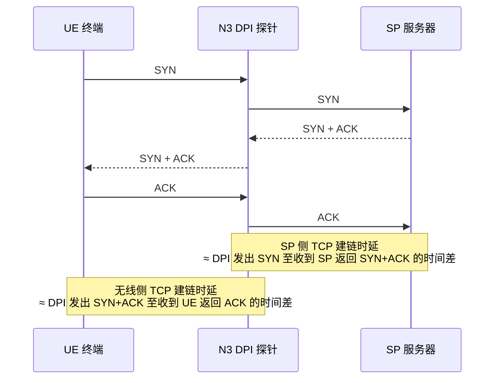
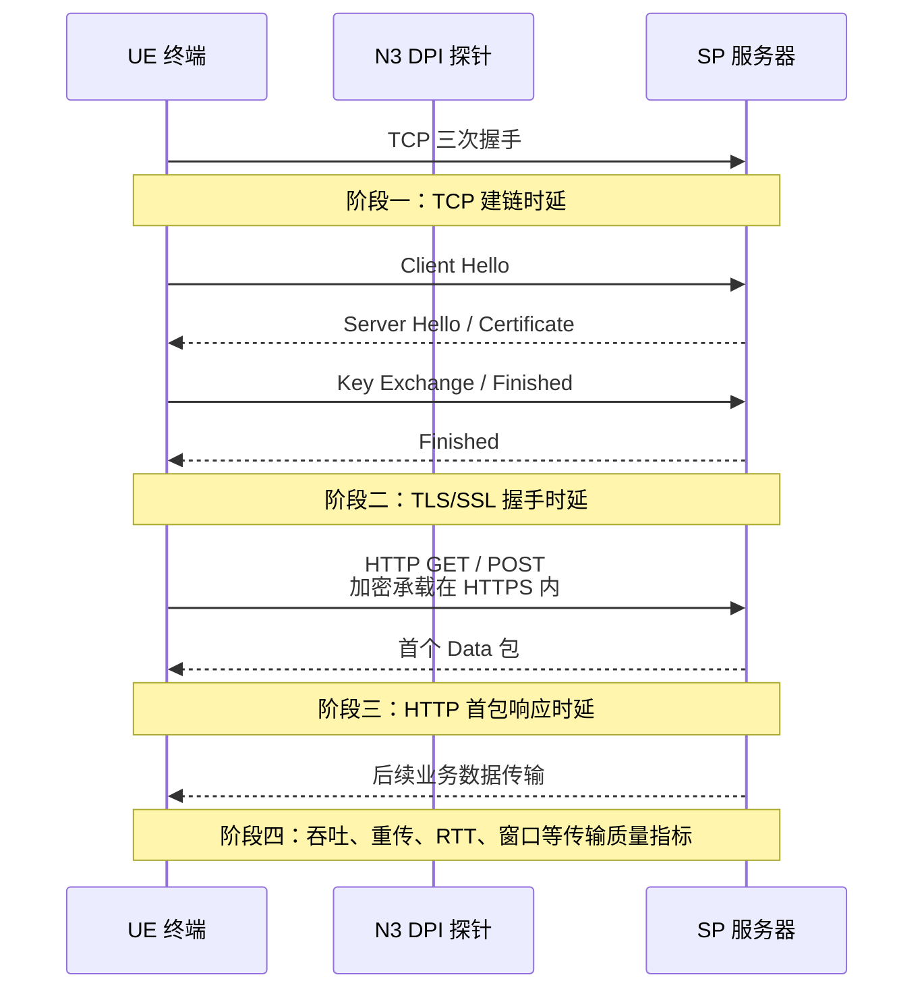
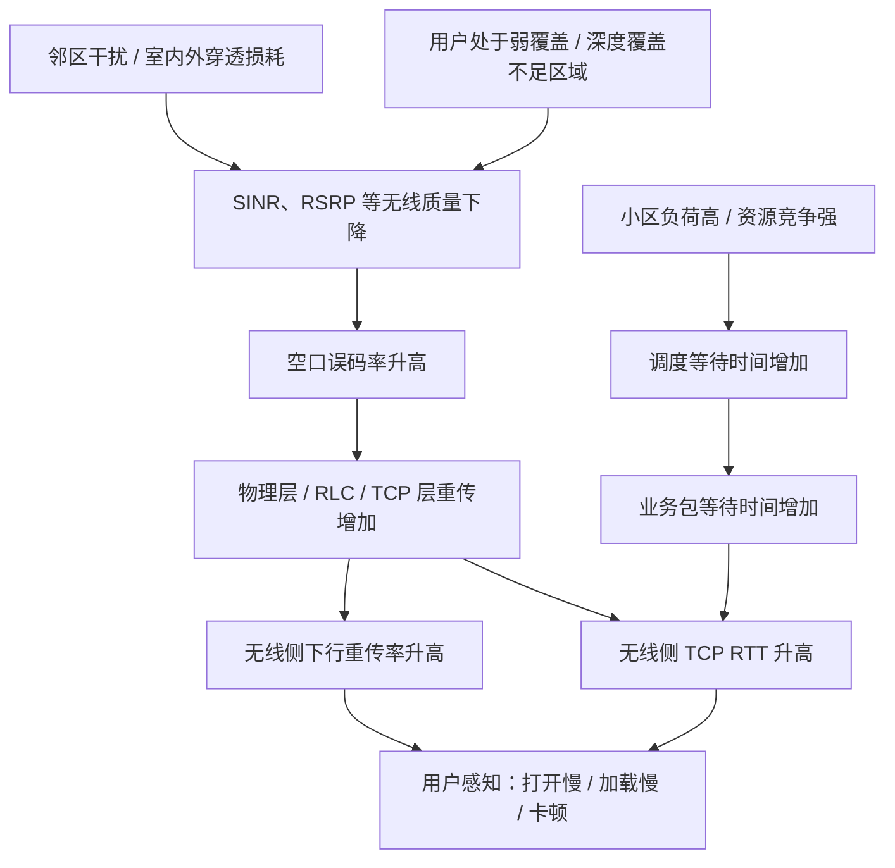
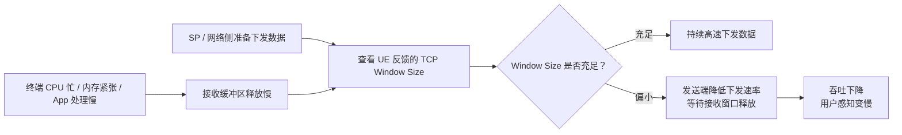
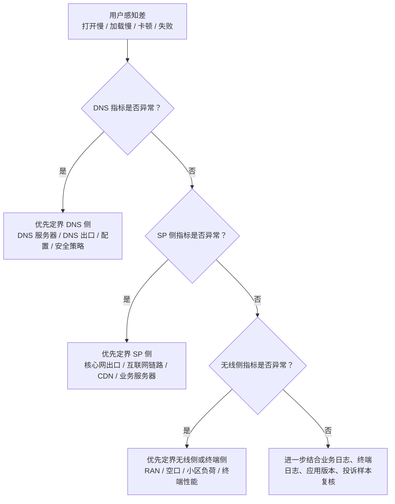

# 基于 XDR 指标的网络问题发生位置定位

## 一、概述

在移动互联网业务感知分析中，用户访问一次业务通常会经历多个关键阶段，包括 **DNS 域名解析**、**TCP 建链**、**TLS/SSL 加密握手**、**HTTP/HTTPS 请求响应**、**数据传输** 等过程。

当用户出现网页打开慢、App 加载慢、视频卡顿、业务失败等问题时，仅依靠单一指标往往难以准确判断问题发生位置，需要结合 XDR（External Data Record，外部数据记录）中的多类协议指标进行分段定界。

基于 N3 接口 DPI（Deep Packet Inspection，深度报文检测）探针采集的数据，可以将端到端业务路径大体拆分为三个分析区段，并可实现对三个区段问题的初步定界分析：

1. **DNS 查询阶段**：判断域名解析是否成功、是否及时；
2. **DPI 探针以上方向，即 DPI → SP 服务器方向**：判断核心网出口、互联网链路、业务源服务器是否存在问题；
3. **DPI 探针以下方向，即 DPI → UE 终端方向**：判断无线接入网、空口环境、终端能力是否存在问题。

通过对不同阶段指标的组合分析，可以实现从“用户感知差”到“问题发生位置”的初步定位，为后续专项优化、投诉处理和端到端质量分析提供依据。

------

## 二、总体定位思路

基于 XDR 指标开展网络问题定位时，不宜直接从单个指标下结论，而应按照业务访问流程进行分段分析。

### 2.1 端到端访问路径示意

### 


N3 接口 DPI 探针通常位于终端与业务服务器之间的关键观测点。以 DPI 探针为界，可以将端到端链路拆分为两个方向：

| 定界方向      | 覆盖范围                                             | 主要判断对象                                 |
| ------------- | ---------------------------------------------------- | -------------------------------------------- |
| DPI → UE 方向 | DPI 探针以下、核心网至无线接入网、空口、终端         | 无线网络质量、空口资源、终端响应能力         |
| DPI → SP 方向 | DPI 探针以上、核心网出口、互联网链路、CDN、SP 服务器 | 互联网传输质量、服务器响应能力、业务处理能力 |
| DNS 查询阶段  | 业务访问前置解析过程                                 | DNS 服务器、DNS 出口链路、DNS 配置、安全策略 |

因此，分析时可以遵循以下基本判断逻辑：

| 判断方向                               | 重点观察指标                                       | 可能问题位置                       |
| -------------------------------------- | -------------------------------------------------- | ---------------------------------- |
| DNS 成功率低、DNS 超时率高             | DNS 解析成功率、DNS 响应超时率                     | DNS 服务器、DNS 出口链路、DNS 配置 |
| SP 侧建链慢、SP 侧 RTT 高、HTTP 首包慢 | SP 侧 TCP 建链时延、SP 侧 RTT、HTTP 响应时延       | 业务服务器、互联网链路、核心网出口 |
| 无线侧 RTT 高、下行重传率高、吞吐低    | 无线侧 TCP RTT、无线侧下行重传率、终端下行吞吐速率 | 无线接入网、空口环境、终端性能     |

------

## 三、DNS 查询阶段问题排查

DNS 查询阶段主要用于判断域名解析环节的效率与可靠性。
如果 DNS 阶段出现异常，后续 TCP 建链、TLS 握手和 HTTP 访问均可能无法正常发起，因此 DNS 是业务访问链路中的前置关键环节。

### 3.1 DNS 查询时序示意



### 3.2 DNS 阶段关键指标

| 指标             | 定义                                                         | 重点指示问题                                                 |
| ---------------- | ------------------------------------------------------------ | ------------------------------------------------------------ |
| DNS 解析成功率   | 统计周期内，收到响应且响应结果为成功的 DNS 报文数，占 DNS 请求报文总数的比例。 | 指标偏低时，通常指示 DNS 服务器异常、地址库配置错误、DNS 出口链路异常，或核心网至 DNS 服务器路径存在严重丢包。 |
| DNS 解析平均时延 | 从 UE 发出 DNS 查询请求，到 DPI 监测到 DNS 响应回包之间的时间差。 | 指标偏高时，通常指示 DNS 服务器负载较高、解析处理逻辑复杂、递归查询链路较长，或 DNS 访问路径存在拥塞。 |
| DNS 响应超时率   | 在规定时间内，例如 3 秒内，未收到 DNS 响应的请求数量，占 DNS 请求总数的比例。 | 指标偏高时，通常指示 DNS 服务器不可达、链路丢包严重，或防火墙、安全策略、ACL 策略对 DNS 报文存在误拦截。 |

### 3.3 参考解释：为什么 DNS 阶段异常会导致业务“还没访问就失败”

一次典型网页或 App 访问，通常不是直接访问业务服务器，而是先通过域名获取目标 IP 地址。
如果 DNS 解析失败，终端无法获知目标服务器 IP，后续 TCP 建链无法发起；如果 DNS 解析时延过高，用户会感知到“App 打开慢”“页面长时间空白”“首次加载慢”。

```text
业务访问前置链路：

输入域名 / App 发起访问
        ↓
DNS 解析域名
        ↓
获得目标 IP 地址
        ↓
TCP 建链
        ↓
TLS/SSL 握手
        ↓
HTTP/HTTPS 请求与响应
```

因此，当 DNS 指标已经异常时，应优先完成 DNS 侧定界，不宜直接将问题归因于无线侧或业务服务器侧。

------

## 四、DPI 探针以上方向问题排查：DPI节点 → SP 服务器

DPI 探针以上方向，主要指从 DPI 探针向业务源服务器（SP，Service Provider）方向的链路。
该阶段主要用于判断 **核心网出口、N6 接口外互联网链路、CDN 节点、业务服务器** 是否存在异常。

如果该方向指标异常，用户通常会表现为：能完成 DNS 解析，也能发起连接，但业务响应慢、页面加载慢、首包返回慢或下载速率不稳定。

### 4.1 TCP 三次握手与建链时延示意



### 4.2 参考解释：建链时延如何区分 SP 侧与无线侧

TCP 建链时延不是一个单一方向的概念。
从 DPI 探针视角看，可以将建链过程拆成两段：

| 指标方向            | 观测逻辑                                                | 定界含义                                          |
| ------------------- | ------------------------------------------------------- | ------------------------------------------------- |
| SP 侧 TCP 建链时延  | DPI 节点向 SP 发出 SYN，到 DPI节点 收到 SP 返回 SYN+ACK | 反映 DPI 至 SP 侧服务器或互联网链路响应能力       |
| 无线侧 TCP 建链时延 | DPI 节点向 UE 发出 SYN+ACK，到 DPI 节点收到 UE 返回 ACK | 反映 DPI 至 UE 侧无线接入、空口调度和终端响应能力 |

如果 **SP 侧建链时延高、无线侧建链时延正常**，问题更可能在 SP 服务器、互联网链路或核心网出口方向。
如果 **无线侧建链时延高、SP 侧建链时延正常**，问题更可能在无线接入网、空口环境或终端侧。

### 4.3 DPI → SP 方向关键指标


| 指标                                 | 定义                                                         | 重点指示问题                                                 |
| ------------------------------------ | ------------------------------------------------------------ | ------------------------------------------------------------ |
| SP 侧 TCP 建链时延，又称首包建链时延 | DPI 监测到 SP 服务器回复 SYN+ACK 报文，与 DPI 向 SP 方向发送 SYN 报文之间的时间差。 | 指标显著升高时，通常指示 SP 服务器 TCP 协议栈响应慢、服务器连接资源不足、连接数达到瓶颈，或 N6 接口外互联网链路存在拥塞。 |
| SP 侧 TCP RTT 时延                   | DPI 探针与 SP 服务器之间 TCP 报文往返的平均时间。            | 反映 DPI 至 SP 侧路径的网络距离、传输质量和链路稳定性。RTT 偏高或抖动较大时，通常指示互联网路径绕路、跨区域访问、链路拥塞或中间节点质量不稳定。 |
| SP 侧 TCP 重传率                     | DPI 向 SP 方向发送的 TCP 报文中，被触发重传的报文占比。      | 指标偏高时，通常指示核心网出口至目标服务器之间存在链路丢包、互联网传输不稳定、出口设备异常或中间链路拥塞。 |
| SSL/TLS 握手时延，适用于 HTTPS 业务  | 从 Client Hello 开始，到加密握手关键阶段完成之间的耗时。     | 指标偏高时，通常指示 SP 服务器加密计算压力较大、证书链处理复杂、加密套件协商效率低，或客户端与服务器之间的传输时延较高。 |
| HTTP 响应时延，又称首包响应时延      | 从 DPI 监测到 GET/POST 请求开始，到收到 SP 返回的首个 Data 数据包之间的时间差。 | 这是判断 SP 业务处理能力的重要指标。指标偏高时，通常指示服务器后端应用处理慢，例如数据库查询慢、业务逻辑处理复杂、页面渲染慢、接口响应慢等。 |

### 4.4 HTTPS 访问阶段时延拆解示意



### 4.5 参考解释：HTTP 首包响应时延为什么更偏向业务侧指标

HTTP 响应时延，特别是首包响应时延，通常反映“请求到达服务器之后，服务器多久开始返回业务数据”。
它不仅包含网络传输时间，还可能受到业务服务器处理逻辑影响，例如：

- 应用服务排队等待；
- 数据库查询慢；
- 接口依赖的下游系统响应慢；
- 页面动态渲染耗时；
- CDN 回源慢；
- 服务器 CPU、内存、连接池资源不足。

因此，如果出现以下现象：

```text
TCP 建链时延正常
RTT 正常
TCP 重传率正常
但 HTTP 首包响应时延明显偏高
```

则更应优先怀疑 **SP 后端应用处理慢**，而不是简单归因为网络传输质量差。

其中，HTTP 响应时延具有较强的业务侧指示意义。
如果 TCP 建链和 RTT 正常，但 HTTP 首包响应明显偏高，通常说明网络传输链路并非主要瓶颈，问题更可能出现在 SP 后端业务处理环节。

------

## 五、DPI 探针以下方向问题排查：DPI节点 → UE 终端

DPI 探针以下方向，主要指从 DPI 探针向 UE（User Equipment，用户终端）方向的链路。
该阶段主要用于判断 **无线接入网、gNodeB、空口环境、用户所处位置、终端处理能力** 是否存在问题。

如果该方向指标异常，用户通常会表现为：同一业务在部分区域、部分小区、部分用户、部分终端上体验较差，尤其是在弱覆盖、强干扰、高负荷场景下更为明显。

### 5.1 无线侧问题形成机制示意



### 5.2 DPI → UE 方向关键指标


| 指标                          | 定义                                                         | 重点指示问题                                                 |
| ----------------------------- | ------------------------------------------------------------ | ------------------------------------------------------------ |
| 无线侧 TCP 建链时延           | DPI 收到终端回复的 ACK 报文，与 DPI 向终端方向发送 SYN+ACK 报文之间的时间差。 | 指标偏高时，通常指示终端侧响应慢、RRC 连接状态不稳定、无线调度等待时间较长、空口资源块 RB（Resource Block）分配受限。 |
| 无线侧 TCP RTT 时延           | DPI 探针与 UE 终端之间数据报文往返的平均时间。               | 这是无线侧定界的关键指标。若无线侧 RTT 显著高于 SP 侧 RTT，通常说明瓶颈更可能出现在无线接入侧，例如信道质量差、物理层重传多、调度等待时间长。 |
| 无线侧下行重传率              | 核心网下行发往终端的 TCP 报文中，由于未收到 ACK 而触发重传的比例。 | 指标偏高时，通常指示空口下行干扰、弱覆盖、深度覆盖不足、无线质量波动，或基站功率、调度资源受限导致的下行丢包。 |
| TCP 接收窗口大小，Window Size | 终端反馈给网络侧的 TCP 接收缓冲区大小。                      | 若窗口值长期偏小，通常指示终端侧处理能力受限、终端系统资源占用高、应用接收能力不足，导致网络侧即使具备传输能力，也无法持续高速下发数据。 |
| 终端下行平均吞吐速率          | 在业务传输期间，单位时间内终端成功接收的应用层有效数据量。   | 若显著低于小区平均水平或同类用户水平，通常指示用户处于小区边缘、干扰区域、弱覆盖区域，或存在空口资源竞争、终端能力不足等问题。 |

### 5.3 参考解释：TCP 接收窗口小不一定是网络侧问题

TCP 接收窗口（Window Size）表示接收端还能接收多少数据。
如果终端反馈的接收窗口长期偏小，说明终端或应用侧“接不动”数据，网络侧即使具备下发能力，也必须降低发送速率。



因此，TCP 接收窗口长期偏小，更偏向反映终端侧或应用侧处理能力问题，不宜简单归因为无线网络差。
实际分析中，应结合终端型号、App 版本、终端系统负载、业务类型和小区无线质量共同判断。


------

## 六、典型组合判断方法

在实际分析中，应尽量采用“指标组合”而非“单指标判断”的方式进行定界。以下是几类常见场景。

### 6.1 组合判断总览图



### 

------

## 七、分析注意事项

在使用 XDR 指标进行问题定位时，需要注意以下几点：

### 7.1 XDR 指标适合做定界，不宜单独作为最终定因依据

XDR 可以帮助判断问题大致发生在哪一段，但最终定因仍需结合 MR、PM、告警、用户投诉、终端信息、业务日志等多源数据。

### 7.2 同一指标在不同业务中含义可能不同

例如视频业务、即时通信业务、网页浏览业务对时延、吞吐、重传的敏感程度不同，应结合业务类型进行解释。

| 业务类型       | 更敏感的指标                              | 说明                         |
| -------------- | ----------------------------------------- | ---------------------------- |
| 网页浏览       | DNS 时延、TCP 建链时延、HTTP 首包响应时延 | 影响页面首次打开速度         |
| 视频业务       | 下行吞吐、重传率、RTT 抖动                | 影响起播、清晰度切换、卡顿   |
| 即时通信       | RTT、丢包、连接稳定性                     | 影响消息发送、语音视频实时性 |
| 文件下载       | 吞吐速率、TCP 窗口、重传率                | 影响下载速度和稳定性         |
| HTTPS App 业务 | TLS 握手时延、HTTP 首包响应时延、TCP RTT  | 影响 App 接口响应和页面加载  |

### 7.3 HTTPS 加密会限制部分应用层可见性

对 HTTPS 业务，DPI 能够观察到 TCP、TLS/SSL 以及部分流量特征，但对加密后的具体业务内容可见性有限，因此需要更多依赖时延、重传、吞吐、SNI、证书、IP、端口等信息进行判断。

```text
HTTPS 场景下 DPI 通常可观察：

可见信息：
- IP 地址
- 端口
- TCP 建链过程
- TCP RTT
- TCP 重传
- TLS/SSL 握手过程
- SNI，若未加密且可见
- 证书信息，视协议版本和加密方式而定
- 流量大小、方向、持续时间

不可直接完整可见：
- 加密后的具体 URL
- 加密后的 HTTP Header 细节
- 加密后的业务内容
- 加密后的接口参数
```

### 7.4 应区分偶发异常与持续性异常

单次 XDR 异常可能由瞬时抖动造成，持续性、区域性、用户群体性异常更具有定位价值。

建议从以下维度进行聚合分析：

- 时间维度：分钟级、小时级、忙时、闲时；
- 空间维度：小区、楼宇、道路、园区、商圈；
- 用户维度：单用户、多用户、同终端型号用户；
- 业务维度：单业务、多业务、同一 SP 不同域名；
- 网络维度：UPF、出口链路、DNS 服务器、CDN 节点。

### 7.5 应重视横向对比

可对比同一小区不同用户、同一用户不同业务、同一业务不同区域、同一 SP 不同出口方向的指标差异，从而提高定界准确性。

------

## 八、总结

基于 XDR 指标开展网络问题发生位置定位，本质上是围绕业务访问流程进行分段定界。
通过 DNS 阶段指标，可以判断域名解析是否可靠；通过 DPI → SP 服务器方向指标，可以判断核心网出口、互联网链路和业务服务器是否存在瓶颈；通过 DPI → UE 终端方向指标，可以判断无线接入网、空口质量和终端能力是否影响用户体验。

在实际应用中，建议按照以下顺序开展分析：

1. **先看 DNS**：确认业务访问是否能够完成域名解析；
2. **再看 SP 侧**：确认服务器和互联网侧是否响应及时；
3. **最后看无线侧和终端侧**：确认空口质量、无线资源和终端能力是否存在瓶颈；
4. **结合多源数据复核**：使用 MR、PM、告警、投诉、终端和业务日志进行交叉验证。

最终目标不是简单判断“网络好不好”，而是把用户感知问题从“现象描述”转化为“位置定界”和“可执行优化方向”。